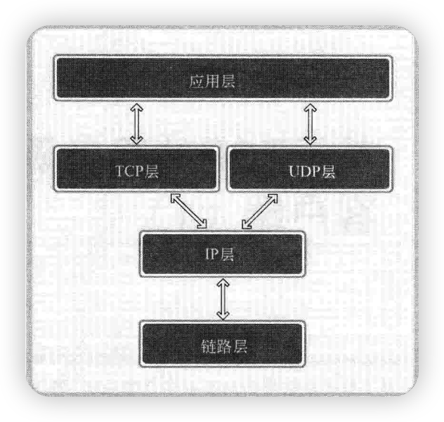
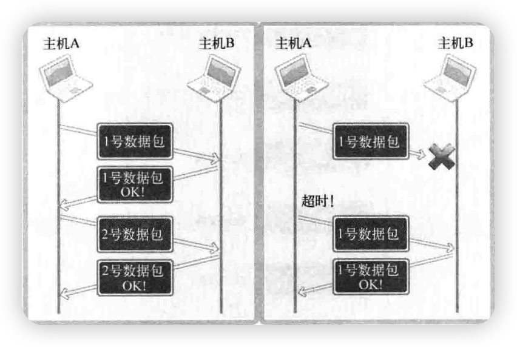
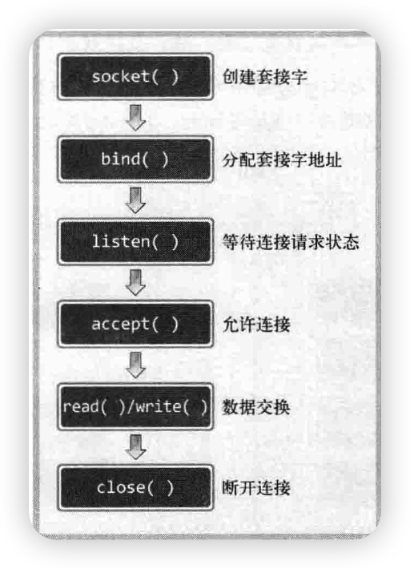
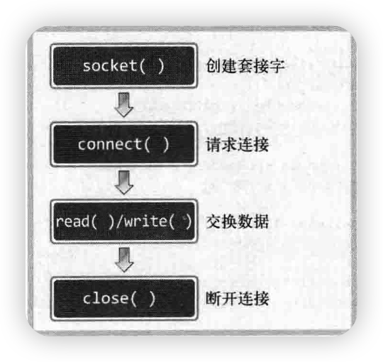
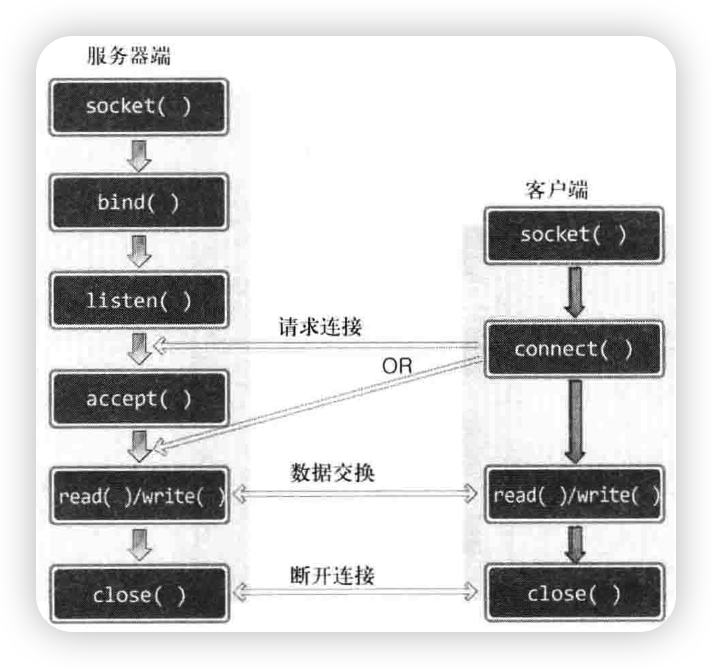
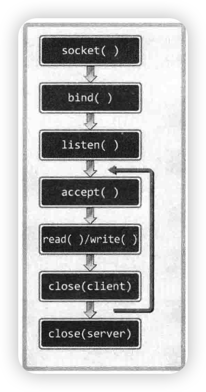

# 第一章 理解编程和套接字

## 1.1 理解编程和套接字

### 1.1.1 网络编程和套接字概要

套接字是网络数据传输用的软件设备。

编程中的“套接字”就是用来连接该网络的工具。

### 1.1.2 构建电话套接字

#### 调用 socket 函数时进行的对话

```c
#include <sys/socket.h>

int socket(int domian, int type, int protocol);
//成功时返回文件描述符，失败时返回-1
```

#### 调用 bind 函数时进行的对话

```c
#include <syd/socket.h>

int bind(int sockfd, struct sockaddr *myaddr, socklen_t addrlen);
//成功时返回0，失败时返回-1
```

#### 调用 listen 函数时进行的对话

```c
#include <sys/socket.h>

int listen(int sockfd, int backlog);
//成功时返回0，失败时返回-1
```

#### 调用 accept 函数时进行的对话

```c
#include <sys/socket.h>

int accpet(int sockfd, struct sockaddr *addr, socklen_t *addrlen);
//成功时返回文件描述符，失败时返回-1
```

网络编程中接受连接请求的套接字创建过程如下:

<<<<<<< HEAD
- 调用 socket 函数创建套接字
- 调用 bind 函数分配 IP 地址和端口号
- 调用 listen 函数转为可接受请求状态
- 调用 accept 函数转为可接受请求状态
=======
- 调用socket函数创建套接字
- 调用bind函数分配IP地址和端口号
- 调用listen函数转为可接受请求状态
- 调用accept函数转为可接受请求状态

## 1.2 基于Linux的文件操作

对Linux而言，socket操作与文件操作没有区别。

在Linux世界里，socket也被认为是文件的一种，因此在网络数据传输过程中自然可以使用文件I/O的相关函数。

### 1.2.1 底层文件访问和文件描述符

"底层"：与标准无关的操作系统独立提供的。

如果想使用Linux提供的文件I/O函数，首先应该理解好文件描述符的概念。

文件和套接字一般经过创建过程才会被分配文件描述符。

### 1.2.2 打开文件

```c
#include <sys/types.h>
#include <sys/stat.h>
#include <fcntl.h>

//path			文件名的字符串信息
//flag			文件打开模式信息
int open(const char *path, int flag);
//成功时返回文件描述符，失败时返回-1
```

### 1.2.3 关闭文件

```c
#include <unistd.h>

//fd			需要关闭的文件或套接字的文件描述符
int close(int fd);
//成功时返回0，失败时返回-1
```

若调用此函数的同时传递文件描述符参数，则关闭相应文件。

此函数不仅可以关闭文件，还可以关闭套接字。

### 1.2.4 将数据写入文件

```c
#include <unistd.h>

//fd			显示数据传输对象的文件描述符
//buf			保存要传输数据的缓冲地址值
//nbytes		要传输数据的字节数
ssize_t write(int fd, const void * buf, size_t nbytes);
//成功时返回写入的字节数，失败时返回-1
```

其中`ssize_t`是通过typedef声明的`unsigned int`类型。

### 1.2.5 读取文件中的数据

```cpp
#include <unistd.h>

//fd			显示数据接收对象的文件描述符
//buf			要保存接收数据的缓冲地址值
//nbytes		要接受数据的最大字节数
ssize_t read(int fd, void *buf, size_t nbytes);
//成功时返回接收的字节数(如果遇到文件结尾返回0)，失败时返回-1
```

# 第二章 套接字类型与协议设置

## 2.1 套接字协议及其数据传输特性

### 2.1.1 关于协议

协议是对话中使用的通信规则，拓展到计算机领域可称为"计算机间对话必备通信规则"。

### 2.1.2 创建套接字

```c
#include <sys/socket.h>

//domain		套接字中使用的协议族信息
//type			套接字数据传输类型信息
//protocol		计算机间通信中使用的协议信息
int socket(int domain, int type, int protocol);
//成功时返回文件描述符，失败时返回-1
```

### 2.1.3 协议族

| 名称      | 协议族               |
| --------- | -------------------- |
| PF_INET   | IPv4互联网协议族     |
| PF_INET6  | IPv6互联网协议族     |
| PF_LOCAL  | 本地通信的UNIX协议族 |
| PF_PACKET | 底层套接字的协议族   |
| PF_IPX    | IPX Novell协议族     |

### 2.1.4 套接字类型

套接字类型指的是套接字的数据传输方式，通过socket函数的第二个参数传递，只有这样才能决定创建的套接字的数据传输方式。

### 2.1.5 面向连接的套接字SOCK_STREAM

面向连接的特征：

- 传输过程中数据不会消失。
- 按序传输数据。
- 传输的数据不存在数据边界。

收发数组的套接字内部有缓冲，简而言之就是字节数组。

> 可靠的、按序传输的、基于字节的面向连接的数据传输方式的套接字。

### 2.1.6 面向消息的套接字SOCK_DGRAM

面向消息的特征：

- 强调快速传输而非传输顺序。
- 传输的数据可能丢失也可能损毁。
- 传输的数据有数据边界。
- 限制每次传输的数据大小。

> 不可靠的、不按序传递的、以数据的高速传输为目的的套接字。

### 2.1.7 协议的最终选择

socket函数的第三个参数决定最终采用的协议。

大部分情况下可以向第三个参数传递0，除非同一协议族中存在多个数据传输方式相同的协议。

### 2.1.8 TCP套接字示例

更改hello_client.c文件中的read函数的调用次数。

在客户端中分多次调用read函数以接受服务器端发送的全部数据。

# 第3章 地址族与数据序列

## 3.1 分配给套接字的IP地址与端口号

IP是Internet Protocol的简写，是为收发网络数据而分配给计算机的值。

端口号并非赋予计算机的值，而是为区分程序中创建的套接字而分配给套接字的序号。

### 3.1.1 网络地址

为使计算机连接到网络并收发数据，必须向其分配IP地址。

IP地址分为两类：

- IPv4	4字节地址族
- IPv6   16字节地址族

### 3.1.2 网络地址分类与主机地址边界

只需通过IP地址的第一个字节即可判断网络地址占用的字节数：

- A类地址的首字节范围：0～127
- B类地址的首字节范围：128～191
- C类地址的首字节范围：192～223

另一种表述方式：

- A类地址的首位以0开始
- B类地址的前两位以10开始
- C类地址的前三位以110开始

### 3.1.3 用于区分套接字的端口号

端口号是在同一操作系统内为不同套接字而设置的，因此无法将一个端口号分配给不同套接字。

端口号由16位组成，可分配的端口号范围是0-65535。

其中0-1023是知名端口，一般分配给特定应用程序。

虽然端口号不会重复，但TCP套接字和UDP套接字不会共用端口号，所以允许重复。

## 3.2 地址信息的表示

### 3.2.1 表示IPv4地址的结构体

下面的结构体将作为地址信息传递给bind函数。

```c
struct sockaddr_in
{
    sa_family_t			sin_family;		//地址族
    uint16_t			sin_port;		//16位TCP/UDP端口号
    struct in_addr	   sin_addr;	   //32位IP地址
    char				sin_zero[8];	//不使用
};
//其中的in_addr结构体定义如下，它用来存放32位IP地址
struct in_addr
{
    In_addr_t			s_addr;			//32位IPv4地址
};
```

### 3.2.2 结构体sockaddr_in的成员分析

#### 成员sin_family

每种协议族适用的地址族均不同。

IPv4使用4字节地址族，IPv6使用16字节地址族。

| 地址族   | 含义                             |
| -------- | -------------------------------- |
| AF_INET  | IPv4网络协议中使用的地址族       |
| AF_INET6 | IPv6网络协议中使用的地址族       |
| AF_LOCAL | 本地通信中采用的UNIX协议的地址族 |

#### 成员sin_port

该成员保存16位端口号，它以网络字节序保存。

#### 成员sin_addr

该成员保存32位IP地址信息，且也以网络字节序保存。

#### 成员sin_zero

无特殊含义，只是为了使结构体sockaddr_in的大小与sockaddr结构体保持一致而插入的成员。必需填充为0，否则无法得到想要的结果。

## 3.3 网络字节序与地址变换

### 3.3.1 字节序与网络字节序

CPU向内存保存数据的方式有2种，这意味着CPU解析数据的方式也分为2种。

- 大端序：高位字节存放到地位地址。
- 小端序：高位字节存放到高位地址。

> 网络传输数据约定同一为网络字节序——即大端序。

先把数据数组转化成大端序格式再进行网络传输。因此，所有计算机接受数据时应识别该数据是网络字节序格式，小端序系统传输数据时应转化为大端序排列方式。

### 3.3.2 字节序转化

以下是转换字节序的函数：

- unsigned short htons(unsigned short);
- unsigned short ntohs(unsigned short);
- unsigned long htonl(unsigned long);
- unsigned long ntohl(unsigned long);

其中：h代表主机(host)字节序，n代表网络(network)字节序。

## 3.4 网络地址的初始化与分配

### 3.4.1 将字符串信息转换为网络字节序的整数型

sockaddr_in中保存地址信息的成员为32位整数型。因此，为了分配IP地址，需要将其表示为32位整数型数据。

下面的函数可以将字符串形式的IP地址转换成32位整数型数据。此函数在转换类型的同时进行网络字节序转换。

```c
#include <arpa/inet.h>

in_addr_t inet_addr(const char *string);
//成功时返回32位大端序整数型值，失败时返回INADDR_NONE
```

如果向上述函数传递一个点分十进制字符串，它会将其转换为32位整数型数据并返回。该整数型值满足网络字节序。该函数的返回值类型in_addr_t在内部声明为32位整数型。

inet_aton函数与inet_addr函数在功能上完全相同，也将字符串形式IP地址转换为32位网络字节序整数并返回。只不过该函数利用了in_addr结构体，且其使用频率更高。

```c
#include <arpa/inet.h>

//string		含有需转换的IP地址信息的字符串地址值
//addr			将保存转换结果的in_addr结构体变量的地址值
int inet_aton(const char *string, struct in_addr * addr);
//成功时返回1，失败时返回0
```

实际编程中若要调用inet_addr函数，需将转换后的IP地址信息带入sockaddr_in结构体中声明的in_addr结构体变量。
而inet_aton函数则不需要此过程。原因在于，若传递in_addr结构体变量地址值，函数会自动把结果填入该结构体变量。

下列函数与inet_aton函数正好相反，此函数可以把网络字节序整数型IP地址转换成我们熟悉的字符串形式。

```c
#include <arpa/inet.h>

char* inet_ntoa(struct in_addr adr);
//成功时返回转换的字符串地址值，失败时返回-1；
```

该函数将通过参数传入的整数型IP地址转换为字符串格式并返回。

### 3.4.2 网络地址初始化

下面是套接字创建过程中常见的网络地址信息初始化方法：

```c
struct sockaddr_in addr;
char *serv_ip = "10.53.46.178";			//声明IP地址字符串
char *serv_port = "9190";				//表明端口号字符串
memset(&addr, 0, sizeof(addr));		   //结构体变量addr的所有成员初始化为0
addr.sin_family = AF_INET;				//指定地址族
addr.sin_addr.s_addr = inet_addr(serv_ip);	//基于字符串的IP地址初始化
addr.sin_port = htons(atoi(serv_port));		//基于字符串的端口号初始化
```

### 3.4.3 客户端地址信息初始化

服务端的准备工作通过bind函数完成，而客户端则通过connect函数完成。

服务端声明sockaddr_in结构体变量，将其初始化为赋予服务器端IP和套接字的端口号，然后调用bind函数；
而客户端则声明sockaddr_in结构体，并初始化为要与之连接的服务器端套接字的IP和端口号，然后调用connect函数。

### 3.4.4 INADDR_ANY

每次创建服务器端套接字都要输入IP地址会有些繁琐，此时可如下初始化地址信息：

```c
struct sockaddr_in addr;
char *serv_port = "9190";
memset(&addr, 0, sizeof(addr));
addr.sin_family = AF_INET;
addr.sin_addr.s_addr = htonl(INADDR_ANY);
addr.sin_port = htons(atoi(serv_port));
```

利用常数INADDR_ANY可以自动获取运行服务器端的计算机IP地址，不用亲自输入。

若同一计算机中已分配多个IP地址，则只要端口号一致，就可以从不同IP地址接受数据。因此，服务器端中优先考虑这种方式。而客户端中除非带有一部分服务器端功能，否则不会采用。

#### 向套接字分配网络地址

bind函数负责把初始化的地址信息分配给套接字：

```c
#include <sys/socket.h>

//sockfd		要分配地址信息的套接字文件描述符
//myaddr		存有地址信息的结构体变量地址值
//addrlen		第二个结构体变量的长度
int bind(int sockfd, struct sockaddr* myaddr, socklen_t addrlen);
//成功时返回0，失败时返回-1
```

如果此函数调用成功，则将第二个参数指定的地址信息分配给第一个参数中的相应套接字。

## 第4章 基于TCP的服务器端/客户端

## 4.1 理解TCP和UDP

TCP套接字是面向连接的，因此又称基于流(stream)的套接字。

### 4.1.1 TCP/IP协议栈



### 4.1.2 链路层

链路层是物理链接领域标准化的结果，也是最基本的领域，专门定义LAN、WAN、MAN等网络标准。

### 4.1.3 IP层

IP本身是面向消息的、不可靠的协议。每次传输数据时会帮我们选择路径，但并不一致。

IP协议无法应对数据错误。

### 4.1.4 TCP/UDP层

TCP和UDP层以IP层提供的路径信息为基础完成实际的数据传输，故该层也称传输层。

IP层只关注一个数据包的传输过程。因此，即使传输多个数据包，每个数据包也是由IP层实际传输的，也就是说传输顺序及传输本身是不可靠的。

TCP可以进行数据交换，如果数据交换过程中可以确认对方已收到数据，并重传丢失的数据，那么即使IP层不保证数据传输，这类通信也是可靠的。



TCP和UDP存在于IP层之上，决定主机之间的数据传输方式，TCP协议确认后向不可靠的IP协议赋予可靠性。

### 4.1.5 应用层

利用套接字编出程序，编写软件的过程中，需要根据程序特点决定服务器端和客户端之间的数据传输规则，这便是应用层协议。

## 4.2 实现基于TCP的服务器端/客户端

### 4.2.1 TCP服务器端的默认函数调用顺序



### 4.2.2 进入等待连接请求状态

此时已经调用bind函数给套接字分配了地址，接下来要通过调用listen函数进入等待连接请求状态。
只有调用了listen函数，客户端才能进入可发出连接请求的状态，此时客户端才能调用connect函数。

```c
#include <sys/socket.h>

//sock		希望进入等待连接请求状态的套接字文件描述符
//backlog	连接请求等待队列的长度
int listen(int sock, int backlog);
//成功返回0，失败时返回-1
```

"服务器端处于等待连接请求状态"：客户端请求连接时，受理连接前一直使请求处于等待状态。

### 4.2.3 受理客户端连接请求

调用listen函数后，若有新的连接请求，则应按序受理。受理请求意味着进入可接受数据的状态。

accept函数自动创建套接字，并连接到发起请求的客户端：

```c
#include <sys/socket.h>

//sock		服务器套接字的文件描述符
//addr		保存发起连接请求的客户端地址信息的变量地址值
//addrlen	第二个参数addr结构体的长度，但是存有长度的变量地址
int accept(int sock, struct sockaddr* addr, socklen_t* addrlen);
//成功时返回创建的套接字文件描述符，失败时返回-1
```

accept函数受理连接请求等待队列中待处理的客户端连接请求。函数调用成功时，accept函数内部将产生用于数据I/O的套接字，并返回其文件描述符。

套接字是自动创建的，并自动与发起连接请求的客户端建立连接。

### 4.2.4 TCP客户端的默认函数调用顺序

创建套接字和请求连接就是客户端的全部内容。



服务端调用listen函数后创建连接请求等待队列，之后客户端即可请求连接：

```c
#include <syd/socket.h>

//sock			客户端套接字文件描述符
//servaddr		保存目标服务器端地址信息的变量地址值
//addrlen		以字节为单位传递已传递给第二个结构体参数servaddr的地址变量长度
int connect(int sock, struct sockaddr* servaddr, socklen_t addrlen);
//成功时返回0，失败时返回-1
```

客户端调用connect函数后，发生以下情况之一才会返回：

- 服务器端接收连接请求
- 发生断网等异常情况而中断连接请求

所谓的"接收连接"并不意味着服务器端调用accept函数，其实是服务器端把连接请求信息记录到等待队列。因此connect函数返回后并不立即进行数据交换。

### 4.2.5 基于TCP的服务器端/客户端函数调用关系



## 4.3 实现迭代服务器端/客户端

### 4.3.1 实现迭代服务器端

服务器设置好等待队列的大小后，应向所有客户端提供服务。如果想继续受理后续的客户端连接请求，应该插入循环语句反复调用accept函数。



调用accept函数后，紧接着调用I/O相关的read、write函数，然后调用close函数。

同一时刻只能服务于一个客户端。

### 4.3.2 迭代回声服务器端/客户端

下面是程序的基本运行方式：

- 服务器端在同一时刻只与一个客户端相连，并提供回声服务。
- 服务器端依次向五个客户端提供服务并退出。
- 客户端接收用户输入的字符串并发送到服务器端。
- 服务器端将接收的字符串数据传回客户端，即"回声"。
- 服务器端与客户端之间的字符串回声一直执行到客户端输入Q为止。

### 4.3.3 回声客户端存在的问题

服务器端希望通过调用1次write函数传输数据，但如果数据太大，操作系统就有可能把数据分成多个数据包发送到客户端。

如果采用上述方式，客户端有可能在尚未收到全部数据包时就调用read函数。

# 第5章 基于TCP的服务器端/客户端(2)

## 5.1 回声客户端的完美实现

### 5.1.1 回声客户端问题解决方法

可以提前确定接受数据的大小，若之前传输了20字节长的字符串，则在接收时循环调用read函数读取20个字节即可。

### 5.1.2 如果问题不在于回声客户端，定义应用层协议

收发数据过程中也需要定好规则(协议)以表示数据的边界，或提前告知收发数据的大小。

